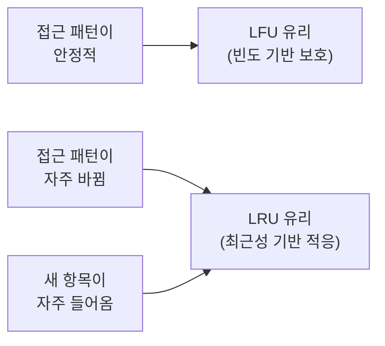

# LRU vs LFU 동작 비교 (2026-03-13)

> `CacheComparisonSimulation.java` 실행 결과를 기반으로 작성.
> 각 시나리오마다 동일한 연산 시퀀스를 LRU, LFU에 동시 적용하고 상태를 관찰했다.

---

## 읽는 법

```
LRU  캐시: [1, 2, 3]          ← LRU → MRU 순서. 왼쪽이 가장 오래됨(제거 1순위)
LFU  캐시: [1(f=1), 2(f=1)]  ← f=freq(접근 횟수). 낮을수록 제거 1순위
```

---

## 시나리오 1: 기본 Eviction — 삽입 순서만 있을 때 (capacity=3)

**목적**: 접근 이력이 없을 때 LRU와 LFU가 같은 항목을 evict함을 확인

```
  put(1, "a")
    LRU  캐시: [1]                             (LRU→MRU 순)
    LFU  캐시: [1(f=1)]

  put(2, "b")
    LRU  캐시: [1, 2]                          (LRU→MRU 순)
    LFU  캐시: [1(f=1), 2(f=1)]

  put(3, "c")  ← 꽉 참
    LRU  캐시: [1, 2, 3]                       (LRU→MRU 순)
    LFU  캐시: [1(f=1), 2(f=1), 3(f=1)]

  [예상 eviction 대상]
    LRU  → 1  (가장 오래전에 삽입)
    LFU  → 1  (동점 중 LRU)

  put(4, "d")  ← eviction 발생
    LRU  캐시: [2, 3, 4]                       (LRU→MRU 순)
    LFU  캐시: [2(f=1), 3(f=1), 4(f=1)]
```

**결론**: 삽입 순서만 있을 때 LRU = LFU. 둘 다 key=1 제거.

접근 이력이 없으면 LFU도 LRU처럼 삽입 순서 기준으로 동작한다. 빈도가 모두 1로 동점이라 동점 처리 기준인 LRU 순서가 적용된다.

---

## 시나리오 2: 핫 아이템 보호 — 빈도 vs 최근성 (capacity=3)

**목적**: 자주 접근된 항목이 있을 때 두 캐시가 **다른 항목을 evict**함

```
  put(1, "a")
    LRU  캐시: [1]                             (LRU→MRU 순)
    LFU  캐시: [1(f=1)]

  get(1) × 10회 — key=1의 빈도를 높임
    → get(1) × 10 완료
    LRU  캐시: [1]                             (LRU→MRU 순)
    LFU  캐시: [1(f=11)]

  put(2, "b")
    LRU  캐시: [1, 2]                          (LRU→MRU 순)
    LFU  캐시: [1(f=11), 2(f=1)]

  put(3, "c")  ← 꽉 참
    LRU  캐시: [1, 2, 3]                       (LRU→MRU 순)
    LFU  캐시: [1(f=11), 2(f=1), 3(f=1)]

  [예상 eviction 대상]
    LRU  → 1  (put 후 get이 없어 LRU 자리로 밀림)
    LFU  → 2  (freq=1 중 가장 오래된 것)

  put(4, "d")  ← eviction 발생
    LRU  캐시: [2, 3, 4]                       (LRU→MRU 순)
    LFU  캐시: [1(f=11), 3(f=1), 4(f=1)]
```

**결론**:
- **LRU**: key=1 제거. `get(1)` 이후 `put(2)`, `put(3)`이 더 최근이라 1이 LRU 자리로 밀린다. LRU는 빈도를 전혀 고려하지 않는다.
- **LFU**: key=2 제거. 1의 freq=11 vs 2,3의 freq=1. 빈도 낮은 항목이 제거된다. 자주 쓰인 1은 보호된다.
- **핵심**: LRU는 "자주 썼지만 최근 put이 없던" 항목을 희생시킨다. 이는 직관에 반할 수 있다.

---

## 시나리오 3: 접근 패턴 변화 — LFU의 빈도 편향 (capacity=3)

**목적**: 과거에 인기 있던 항목이 이제 안 쓰일 때 두 캐시의 반응 차이

```
  put(1,2,3)  ← 초기 상태
    LRU  캐시: [1, 2, 3]                       (LRU→MRU 순)
    LFU  캐시: [1(f=1), 2(f=1), 3(f=1)]

  [Phase 1] key=1을 집중 접근 — 과거의 '핫' 아이템
    get(1) × 10 완료
    LRU  캐시: [2, 3, 1]                       (LRU→MRU 순)
    LFU  캐시: [1(f=11), 2(f=1), 3(f=1)]

  [Phase 2] 접근 패턴 변화 — 이제 key=2, 3이 핫해짐
    get(2)×8, get(3)×8 완료
    LRU  캐시: [1, 2, 3]                       (LRU→MRU 순)
    LFU  캐시: [1(f=11), 2(f=9), 3(f=9)]

  [예상 eviction 대상]
    LRU  → 1  (get(3)이 가장 최근, get(2) 그 다음, 1이 LRU)
    LFU  → 2  (freq: 1=11, 2=9, 3=9. 동점 중 LRU=2)

  put(4, "d")  ← eviction 발생
    LRU  캐시: [2, 3, 4]                       (LRU→MRU 순)
    LFU  캐시: [1(f=11), 3(f=9), 4(f=1)]
```

**결론**:
- **LRU**: key=1 제거. 최근에 아무도 쓰지 않았으므로 LRU로 밀린다. 현재 패턴에 빠르게 적응.
- **LFU**: key=2 제거. key=1의 과거 freq=11이 높아 보호된다. **빈도 편향(Frequency Bias)** 발생.
- **핵심**: LFU는 "이제 필요 없는" 항목을 과거 빈도를 이유로 계속 메모리에 붙잡는다. CDN, SNS 트렌드처럼 인기 콘텐츠가 빠르게 바뀌는 환경에서 LFU가 불리한 이유다.

---

## 시나리오 4: Cold Start — 새 항목의 생존 가능성 (capacity=2)

**목적**: 기존 고빈도 항목들 사이에 새 항목이 들어올 때의 차이

```
  put(1,2)  ← 초기
    LRU  캐시: [1, 2]                          (LRU→MRU 순)
    LFU  캐시: [1(f=1), 2(f=1)]

  key=1, 2 모두 고빈도로 만들기 (각 5회)
    get(1)×5, get(2)×5 완료
    LRU  캐시: [1, 2]                          (LRU→MRU 순)
    LFU  캐시: [1(f=6), 2(f=6)]

  [put(3) 예상 eviction 대상]
    LRU  → 1  (get(2) 최근 → 2=MRU, 1=LRU)
    LFU  → 1  (freq 동점, LRU 기준 1이 먼저)

  put(3, "c")  ← 새 항목 삽입, eviction 발생
    LRU  캐시: [2, 3]                          (LRU→MRU 순)
    LFU  캐시: [2(f=6), 3(f=1)]

  새 항목 key=3에 3회 접근 — 빈도를 쌓아봄
    get(3)×3 완료
    LRU  캐시: [2, 3]                          (LRU→MRU 순)
    LFU  캐시: [2(f=6), 3(f=4)]

  [put(4) 예상 eviction 대상]
    LRU  → 2
    LFU  → 3

  put(4, "d")  ← 또 새 항목, eviction 발생
    LRU  캐시: [3, 4]                          (LRU→MRU 순)
    LFU  캐시: [2(f=6), 4(f=1)]
```

**결론**:
- **LRU**: `get(3)`으로 3이 MRU → 2가 LRU → key=2 제거. **새 항목 3이 생존**.
- **LFU**: 3의 freq=4 < 2의 freq=6 → key=3 제거. **새 항목 3이 희생됨**.
- **핵심**: LFU의 Cold Start 약점. 새 항목은 누적 freq가 낮아 기존 고빈도 항목과 경쟁이 안 된다. 아무리 앞으로 자주 쓰일 항목이어도 초기에 쫓겨날 수 있다.

---

## 정리

| 시나리오 | LRU 결과 | LFU 결과 | 승자 |
|----------|----------|----------|------|
| 1. 순수 삽입 순서 | key=1 제거 | key=1 제거 | 동일 |
| 2. 핫 아이템 보호 | key=1 제거 (**자주 쓴 항목 희생**) | key=2 제거 (저빈도 제거) | LFU |
| 3. 패턴 변화 | key=1 제거 (현재 패턴 반영) | key=2 제거 (**과거 빈도 집착**) | LRU |
| 4. Cold Start | key=2 제거 (새 항목 생존) | key=3 제거 (**새 항목 희생**) | LRU |



**LRU를 쓸 때**: 접근 패턴이 시간에 따라 변하는 경우, 새 항목이 자주 삽입되는 경우
**LFU를 쓸 때**: 접근 패턴이 장기간 안정적인 경우, 반복 접근이 확실한 핫 아이템이 있는 경우

Redis의 `allkeys-lfu`가 `allkeys-lru`보다 히트율이 높은 경우는 대부분 "특정 키가 압도적으로 자주 접근되는 워크로드"다. 그렇지 않으면 LRU 또는 W-TinyLFU(Caffeine)가 더 낫다.
