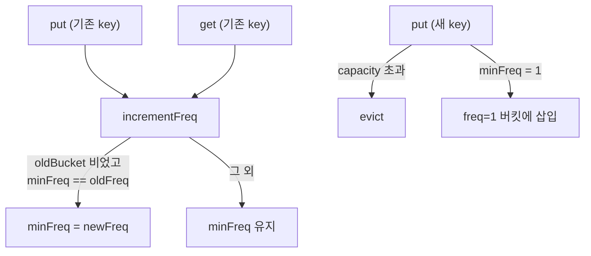

# LFU Cache 설계 결정 (2026-03-13)

## LFU란

**Least Frequently Used** — 캐시가 꽉 찼을 때 접근 빈도가 가장 낮은 항목을 제거하는 교체 정책.

같은 빈도의 항목이 여럿일 경우, 그 중 가장 오래전에 사용된 항목(LRU 기준)을 제거한다.

### 역사적 배경

LFU는 LRU와 같은 시대인 1960년대 말~1970년대 초 가상 메모리 페이징 연구에서 등장했다. 단일 창시자가 있는 알고리즘이 아니라 캐시 교체 정책 연구의 흐름 속에서 자연스럽게 정의된 개념이다.

> Mattson, R. L., Gecsei, J., Slutz, D. R., and Traiger, I. L. (1970).
> "Evaluation Techniques for Storage Hierarchies."
> *IBM Systems Journal*, Vol. 9, No. 2, pp. 78–117.

이 논문에서 LFU를 포함한 빈도 기반 교체 정책들이 공식적으로 평가되었다. LFU가 stack algorithm임도 이 논문에서 수학적으로 증명되었다 — Belady's Anomaly가 발생하지 않는다.

LRU와 LFU를 하나의 연속적 스펙트럼으로 통합한 연구:

> Lee, D., Choi, J., Kim, J.-H., Noh, S.H., Min, S.L., Cho, Y., & Kim, C.S. (2001).
> "LRFU: A spectrum of policies that subsumes the least recently used and least frequently used policies."
> *IEEE Transactions on Computers*, 50(12), pp. 1352–1361.
> DOI: 10.1109/TC.2001.970573

---

## LFU vs LRU

| | LRU | LFU |
|---|---|---|
| 제거 기준 | 가장 오래전에 사용된 항목 | 가장 적게 사용된 항목 |
| 추적 대상 | 최근성(recency) | 빈도(frequency) |
| 순차 스캔 내성 | 취약 — 스캔이 캐시 오염 | 상대적으로 강함 |
| 변화하는 패턴 | 빠르게 적응 | 느리게 적응 (과거 빈도 잔존) |
| cold start | 문제 없음 | 취약 — 새 항목이 즉시 evict됨 |
| 구현 복잡도 | 낮음 | 높음 |

---

## 왜 HashMap + HashMap(freq → LinkedHashSet)인가

LFU 캐시의 핵심 요건: `get`과 `put` 모두 **O(1)**.

### Heap 기반 LFU의 문제

가장 단순한 LFU 구현은 min-heap을 사용한다. eviction은 O(1)이지만, `get` 시 빈도를 갱신하면서 heap을 재정렬해야 하므로 O(log n)이다. LRU가 O(1)인 것과 달리 LFU가 실무에서 외면받은 주된 이유였다.

### O(1) LFU 구현

2010년 Dhruv Matani, Ketan Shah, Anirban Mitra가 모든 연산을 O(1)으로 달성하는 알고리즘을 발표했다.

> Matani, D., Shah, K., & Mitra, A. (2010).
> "An O(1) algorithm for implementing the LFU cache eviction scheme."
> arXiv:2110.11602. http://dhruvbird.com/lfu.pdf

원 논문의 구조: 빈도 노드들의 Doubly Linked List + 각 빈도 노드 안에 같은 빈도의 항목들을 담는 또 다른 Doubly Linked List.

### 이 구현에서의 단순화

원 논문의 이중 DLL 대신 `LinkedHashSet`을 사용한다.

```
keyMap:  key → Node (key, value, freq)         — O(1) 조회
freqMap: freq → LinkedHashSet<key>             — O(1) 빈도별 그룹 관리
minFreq: 현재 최소 빈도 추적                    — O(1) eviction 대상 식별
```

`LinkedHashSet`은 삽입 순서를 보존한다. 같은 빈도 내에서 가장 먼저 삽입된 key = 가장 오래된 항목이므로, 빈도 동점 시 LRU 기준 처리가 자동으로 된다.

---

## Sentinel 노드가 없는 이유

LRUCache는 Doubly Linked List에 더미 head/tail을 사용했다. LFUCache는 LinkedHashSet을 쓰므로 경계 조건이 컬렉션 내부에서 처리된다. 더미 노드가 필요 없다.

---

## Node에 freq를 저장하는 이유

`incrementFreq(node)` 시 기존 빈도 버킷에서 해당 key를 꺼내야 한다.

```java
int oldFreq = node.freq;  // node가 자신의 빈도를 알아야 함
LinkedHashSet<K> oldBucket = freqMap.get(oldFreq);
oldBucket.remove(node.key);
```

Node가 `freq`를 저장하지 않으면 어느 버킷에 있는지 알 수 없어 freqMap 전체를 순회해야 한다 — O(n). `freq` 필드로 O(1) 처리한다.

---

## minFreq를 별도로 추적하는 이유

eviction 대상은 `freqMap`에서 최소 빈도 버킷의 첫 번째 항목이다. `freqMap`은 HashMap이므로 최솟값을 O(1)로 찾을 수 없다. 전체를 순회하면 O(n).

`minFreq` 변수 하나로 O(1) eviction이 가능하다.

`minFreq` 갱신 규칙:
- 새 항목 삽입 시: 항상 `minFreq = 1` (새 항목은 freq=1로 시작)
- 기존 항목 빈도 증가 시: 이전 버킷이 비었고 `minFreq == oldFreq`이면 `minFreq = newFreq`

---

## 핵심 연산 분석

### get(key)

```
1. keyMap에서 key로 노드 조회 — O(1)
2. 없으면 null 반환
3. 있으면 incrementFreq() 호출 — O(1)
4. value 반환
```

### put(key, value)

**이미 존재하는 key인 경우:**
```
1. keyMap에서 노드 조회 — O(1)
2. value 갱신
3. incrementFreq() 호출 — O(1)
```

**새 key인 경우:**
```
1. capacity 초과 시 evict() 호출 — O(1)
2. freq=1로 새 노드 생성
3. keyMap에 추가 — O(1)
4. freqMap[1] 버킷에 key 추가 — O(1)
5. minFreq = 1
```

### incrementFreq (내부)

```
1. 현재 freq 읽기 (node.freq)
2. freqMap[oldFreq]에서 key 제거 — O(1)
3. 버킷이 비었으면 제거, minFreq 갱신 — O(1)
4. freqMap[newFreq] 버킷에 key 추가 — O(1)
5. node.freq 증가
```

### evict (내부)

```
1. freqMap[minFreq] 버킷의 첫 번째 key 획득 (LRU 기준) — O(1)
2. 버킷에서 제거 — O(1)
3. 버킷이 비었으면 freqMap에서 제거
4. keyMap에서 제거 — O(1)
```

---

## minFreq 갱신 연산 흐름



---

## LRUCache와의 구현 비교

| | `LRUCache` | `LFUCache` |
|---|---|---|
| 주요 자료구조 | HashMap + Doubly Linked List | HashMap + HashMap(freq→LinkedHashSet) |
| 추가 추적 변수 | 없음 | `minFreq` |
| Node 추가 필드 | `prev`, `next` | `freq` |
| Sentinel 노드 | O (head/tail) | X |
| eviction 기준 | 최근성(recency) | 빈도(frequency) + 동점 시 LRU |
| 동점 처리 | 해당 없음 | 삽입 순서 (LinkedHashSet) |

---

## 실세계 사용 사례

### Redis allkeys-lfu / volatile-lfu (Redis 4.0+)

Redis는 LFU를 LRU와 동일한 근사(approximated) 방식으로 구현한다.

**Morris Counter (확률적 로그 카운터)**:
- 카운터 범위: 0~255 (8비트)
- 카운터 값이 클수록 증가 확률 감소: `P = 1 / (1 + counter × lfu_log_factor)`
- 수백만 회 접근도 255 이내로 표현 가능

| 파라미터 | 기본값 | 의미 |
|----------|--------|------|
| `lfu-log-factor` | 10 | 카운터 포화에 필요한 접근 횟수 조절 |
| `lfu-decay-time` | 1(분) | 이 시간이 지나면 카운터 감소 — 캐시 오염 방지 |

`lfu-decay-time`이 핵심이다. 이 decay 메커니즘 덕분에 Redis LFU는 순수 LFU의 캐시 오염 문제를 완화한다. 과거에 인기 있었던 항목도 시간이 지나면 카운터가 감소해 eviction 후보가 된다.

Redis 공식 문서:
> "LFU has some tunable parameters: for instance, how fast should a frequent item lower in rank if it gets no longer accessed? It is also possible to tune the Morris counters range in order to better adapt the algorithm to specific use cases."

---

## LFU의 구조적 문제

### 1. 빈도 편향 (Frequency Bias) — 캐시 오염

과거에 집중 접근되었다가 더 이상 사용되지 않는 항목이 높은 카운터 값을 유지한 채 캐시를 차지한다. 새로 유행하는 콘텐츠(빈도=10)가 과거 인기 콘텐츠(빈도=10,000)를 밀어내지 못한다.

Redis 공식 블로그:
> "LFU might keep stale popular items in memory for too long."

### 2. Cold Start 문제

새로 삽입된 항목은 freq=1로 시작한다. 아무리 앞으로 자주 쓰일 항목이라도 기존 항목의 누적 카운터보다 낮아 즉시 evict될 위험이 높다. LRU는 새 항목이 MRU(가장 최근) 위치에 삽입되므로 이 문제가 없다.

### 3. 변화하는 액세스 패턴

LFU는 접근 패턴이 안정적이고 예측 가능한 워크로드에 적합하다. CDN, SNS 트렌드처럼 인기 콘텐츠가 빠르게 바뀌는 환경에서는 과거 빈도가 미래 접근을 예측하는 지표로서 가치를 잃는다.

---

## LFU 변형 알고리즘

### LFU with Dynamic Aging (LFUDA)

전역 aging factor(L)를 유지한다. 항목의 키 값을 단순 빈도가 아닌 `빈도 + L`로 설정하고, eviction 시 L을 해당 항목의 키 값으로 갱신한다. 오래된 인기 항목의 키 값이 상대적으로 낮아져 eviction 후보가 된다.

> Arlitt, M., Cherkasova, L., Dilley, J., Friedrich, R., & Jin, T. (2000).
> "Evaluating content management techniques for web proxy caches."
> *ACM SIGMETRICS Performance Evaluation Review*, vol. 27, no. 4, pp. 3–11.

### LFRU (Least Frequently/Recently Used)

캐시를 두 파티션으로 분할한다.

| 파티션 | 정책 | 역할 |
|--------|------|------|
| Privileged (특권) | LRU | 자주 쓰이는 인기 콘텐츠 보호 |
| Unprivileged (비특권) | 근사 LFU | 새 항목 진입 및 평가 |

빈도가 쌓인 항목이 Unprivileged에서 Privileged로 승격된다. ICN(Information-Centric Network) 환경을 위해 설계되었다.

> Bilal, M., & Kang, S.-G. (2017).
> "A Cache Management Scheme for Efficient Content Eviction and Replication in Cache Networks."
> arXiv:1702.04078.

---

## InMemoryCacheTemplate / LRUCache와의 비교

| | `InMemoryCacheTemplate` | `LRUCache` | `LFUCache` |
|---|---|---|---|
| 목적 | 실용 캐시 | LRU 알고리즘 구현 | LFU 알고리즘 구현 |
| TTL | O | X | X |
| Eviction 정책 | 만료 시간 기반 | 최근성(recency) | 빈도(frequency) |
| Cold Start | 해당 없음 | 강함 | 취약 |
| 순차 스캔 내성 | 해당 없음 | 취약 | 상대적으로 강함 |
| 동시성 | ConcurrentHashMap | HashMap | HashMap |

---

## 시간/공간 복잡도

| 연산 | 시간 복잡도 |
|------|------------|
| `get` | O(1) |
| `put` | O(1) |

| 자료구조 | 공간 복잡도 |
|----------|------------|
| keyMap | O(capacity) |
| freqMap (버킷 합산) | O(capacity) |
| 전체 | O(capacity) |

---

## 한계

### 스레드 안전하지 않음

`HashMap`과 `LinkedHashSet` 조작이 원자적이지 않다. 멀티스레드 환경에서는 `keyMap`, `freqMap`, `minFreq` 세 가지를 동시에 동기화해야 한다. LRUCache보다 동기화 범위가 넓어 더 복잡하다.

### null value 구분 불가

`get()`이 `null`을 반환할 때 "키 없음"과 "값이 null"을 구분할 수 없다.

### Cold Start에 취약

새 항목이 자주 쓰일 항목이라도 초기에 evict될 수 있다. W-TinyLFU의 Window 캐시(LRU 1%)가 이 문제를 완화한다.

---

## 출처

| 주제 | 출처 | 인용 정보 |
|------|------|-----------|
| LFU 공식 평가 / Stack Algorithm 증명 | Mattson et al. (1970) | "Evaluation Techniques for Storage Hierarchies." *IBM Systems Journal*, Vol. 9, No. 2, pp. 78–117 |
| LRU-LFU 스펙트럼 통합 | Lee et al. (2001) | "LRFU: A spectrum of policies that subsumes the least recently used and least frequently used policies." *IEEE Transactions on Computers*, 50(12), pp. 1352–1361. DOI: 10.1109/TC.2001.970573 |
| O(1) LFU 알고리즘 | Matani, Shah, Mitra (2010) | "An O(1) algorithm for implementing the LFU cache eviction scheme." arXiv:2110.11602. http://dhruvbird.com/lfu.pdf |
| LFUDA | Arlitt et al. (2000) | "Evaluating content management techniques for web proxy caches." *ACM SIGMETRICS Performance Evaluation Review*, vol. 27, no. 4, pp. 3–11 |
| LFRU | Bilal & Kang (2017) | "A Cache Management Scheme for Efficient Content Eviction and Replication in Cache Networks." arXiv:1702.04078 |
| Redis LFU 구현 | Redis 공식 문서 | https://redis.io/docs/latest/develop/reference/eviction/ |
| Redis LFU vs LRU | Redis 공식 블로그 | https://redis.io/blog/lfu-vs-lru-how-to-choose-the-right-cache-eviction-policy/ |
