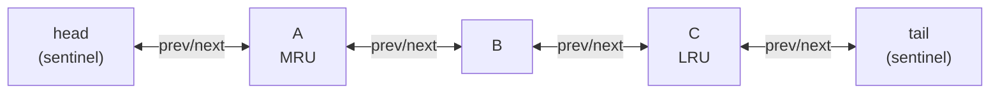
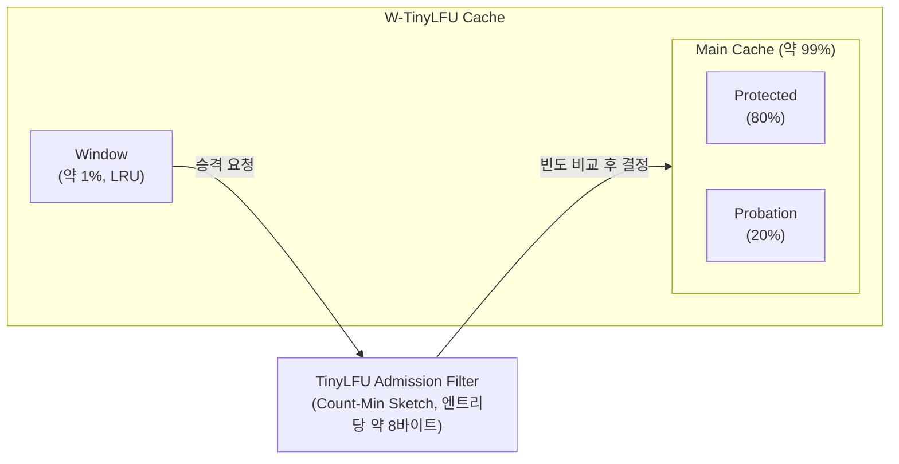
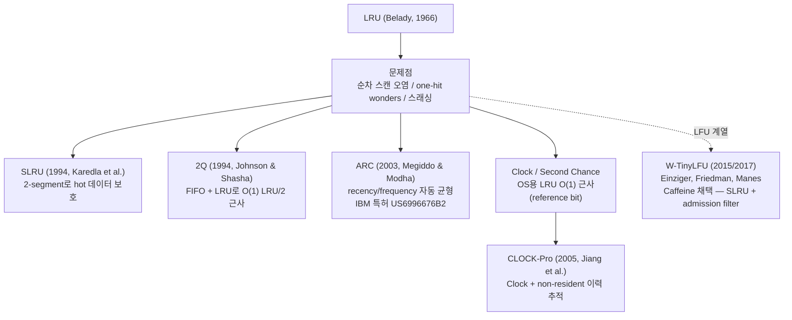

# LRU Cache 설계 결정 (2026-03-13)

## LRU란

**Least Recently Used** — 캐시가 꽉 찼을 때 가장 오래전에 사용된 항목을 제거하는 교체 정책.

"사용"은 `get`과 `put` 모두 해당한다. 마지막으로 접근한 시점이 가장 오래된 항목이 제거 대상이다.

### 역사적 배경

LRU는 단일 인물이 발명한 알고리즘이 아니다. 1960년대 초 IBM과 MIT의 가상 메모리 연구에서 이미 통용되던 개념이었다. 이를 처음으로 체계적으로 분석하고 타 알고리즘과 비교한 인물이 **L. A. Belady**다.

> Belady, L. A. (1966). "A study of replacement algorithms for a virtual-storage computer."
> *IBM Systems Journal*, Vol. 5, No. 2, pp. 78–101.

이 논문에서 Belady는 Random, FIFO, LRU, OPT(MIN) 알고리즘을 체계적으로 비교 분석했다.

### Temporal Locality — LRU가 작동하는 이유

LRU의 효과는 **temporal locality(시간 지역성)** 원리에 기반한다.

> 최근에 접근된 데이터는 가까운 미래에 다시 접근될 가능성이 높다.

이 개념을 처음 공식화한 인물은 **Peter J. Denning**이다.

> Denning, P. J. (1968). "The Working Set Model for Program Behavior."
> *Communications of the ACM*, Vol. 11, No. 5, pp. 323–333.

Denning은 프로그램이 특정 시점에 집중적으로 사용하는 페이지 집합(working set)이 존재한다는 것을 증명했다. Temporal locality가 강한 워크로드에서 LRU는 "최근에 쓰인 것은 또 쓰인다"는 원리를 그대로 활용한다.

---

## 이론적 최적: OPT(MIN) vs LRU

**OPT(MIN)** 알고리즘은 Belady(1966)가 제안한 이론적 최적 교체 정책이다.

> 교체 시점에, 앞으로 가장 오랫동안 참조되지 않을 항목을 제거한다.

이 알고리즘은 page fault 횟수를 이론적으로 최소화한다. 하지만 **미래의 참조 순서를 사전에 알아야 하므로 실제 구현이 불가능하다.** 오프라인 알고리즘으로, 벤치마크의 기준선(upper bound)으로만 사용된다.

LRU는 OPT의 실용적 근사다. OPT가 미래를 보고 결정하는 반면, LRU는 과거를 보고 결정한다. Temporal locality가 강한 워크로드에서 과거 패턴이 미래 패턴을 잘 예측하기 때문에, LRU는 OPT에 근접한 성능을 낸다.

| 알고리즘     | 원리                  | 구현 가능 여부       |
|----------|---------------------|----------------|
| OPT(MIN) | 미래에 가장 늦게 참조될 항목 제거 | X (오프라인 전용)    |
| LRU      | 가장 오래전에 사용된 항목 제거   | O              |
| FIFO     | 가장 먼저 들어온 항목 제거     | O (성능 낮음)      |
| Random   | 무작위 제거              | O (FIFO보다는 나음) |

---

## Belady's Anomaly와 Stack 알고리즘

**Belady's Anomaly**: 페이지 프레임(메모리 용량)을 늘렸는데, page fault 횟수가 오히려 증가하는 현상.

> Belady, L. A., Nelson, R. A., & Shedler, G. S. (1969).
> "An anomaly in space-time characteristics of certain programs running in a paging machine."
> *Communications of the ACM*, Vol. 12, No. 6, pp. 349–353.

FIFO는 이 anomaly가 발생한다. LRU는 발생하지 않는다.

이유: LRU는 **stack algorithm**이기 때문이다.

**Stack Property (포함 성질)**:
> 크기 N인 캐시에 들어있는 항목 집합은, 크기 N+1인 캐시에 들어있는 항목 집합의 부분집합이다.

LRU의 크기-N 캐시 = "최근 사용 순위 상위 N개 항목". 크기가 늘어날수록 포함하는 항목 집합도 단조 증가한다. Mattson et al.(1970)이 LRU, OPT, LFU가 모두 stack algorithm임을 수학적으로 증명했다.

> Mattson, R. L., Gecsei, J., Slutz, D. R., and Traiger, I. L. (1970).
> "Evaluation Techniques for Storage Hierarchies."
> *IBM Systems Journal*, Vol. 9, No. 2, pp. 78–117.

---

## 왜 HashMap + Doubly Linked List인가

LRU 캐시의 핵심 요건: `get`과 `put` 모두 **O(1)**.

### HashMap만으로는 부족한 이유

HashMap은 O(1) 조회를 제공하지만, "어떤 항목이 가장 오래전에 사용됐는지" 순서 정보가 없다.

### Heap이 아닌 이유

Heap은 최솟값 추출이 O(1)이지만, `get` 시마다 해당 노드의 우선순위를 갱신해야 한다. Heap에서 임의 노드의 위치 변경은 O(log n)이다.

### Doubly Linked List를 선택한 이유

| 연산       | Singly Linked List      | Doubly Linked List     |
|----------|-------------------------|------------------------|
| 임의 노드 삭제 | O(n) — 이전 노드를 순회로 찾아야 함 | O(1) — prev 포인터로 즉시 접근 |
| 노드 이동    | O(n)                    | O(1)                   |

Singly Linked List에서 노드를 삭제하려면 이전 노드의 `next`를 바꿔야 한다. 이전 노드를 찾으려면 head부터 순회해야 해 O(n)이다. Doubly Linked List는 각 노드가 `prev`를 갖기 때문에 이전 노드를 O(1)로 알 수 있다.

### 조합의 역할

```
HashMap:            key → Node 참조  (O(1) 조회)
Doubly Linked List: 노드 순서 관리   (O(1) 위치 변경)
```

HashMap이 노드의 참조를 들고 있으므로, 조회 후 Linked List에서의 위치 이동도 O(1)로 처리된다.

---

## Sentinel(더미) 노드를 사용한 이유

`head`와 `tail`은 실제 데이터를 담지 않는 더미 노드다.

더미 노드 없이 구현하면 다음 경우를 모두 분기 처리해야 한다:

- 리스트가 비어있을 때 첫 노드 삽입
- head 노드 삭제
- tail 노드 삭제
- 노드가 1개일 때 삭제

더미 노드가 있으면 실제 노드는 항상 `head.next`와 `tail.prev` 사이에 위치하므로, `addToHead`와 `removeNode`가 경계 조건 없이 단일 로직으로 동작한다.



---

## Node에 key를 저장해야 하는 이유

eviction 시 tail 노드를 Linked List에서 제거한 뒤, HashMap에서도 제거해야 한다.

```java
Node<K, V> evicted = removeTail();
map.remove(evicted.key);  // key가 없으면 HashMap에서 못 찾음
```

Node에 key가 없으면 HashMap 전체를 순회해서 해당 노드를 가진 key를 찾아야 한다 — O(n). Node에 key를 저장해 O(1)로 처리한다.

---

## 핵심 연산 분석

### get(key)

```
1. HashMap에서 key로 노드 조회 — O(1)
2. 없으면 null 반환
3. 있으면 해당 노드를 head 바로 뒤로 이동 — O(1)
4. value 반환
```

### put(key, value)

**이미 존재하는 key인 경우:**

```
1. HashMap에서 노드 조회 — O(1)
2. value 갱신
3. head 바로 뒤로 이동 — O(1)
```

**새 key인 경우:**

```
1. 새 노드 생성
2. HashMap에 추가 — O(1)
3. head 바로 뒤에 삽입 — O(1)
4. capacity 초과 시:
   - tail 바로 앞 노드(LRU) 제거 — O(1)
   - HashMap에서도 제거 — O(1)
```

### removeNode (내부)

```java
node.prev.next =node.next;
node.next.prev =node.prev;
```

두 줄로 임의 노드를 O(1)로 제거. 더미 노드 덕분에 경계 조건 분기 없음.

### addToHead (내부)

```java
node.prev =head;       // node의 prev → dummy head
node.next =head.next;  // node의 next → 기존 첫 번째 노드
head.next.prev =node;  // 기존 첫 번째 노드의 prev → node  ← head.next를 바꾸기 전에 먼저
head.next =node;       // dummy head의 next → node
```

순서가 중요하다. `head.next`를 바꾸기 전에 기존 첫 번째 노드의 `prev`를 먼저 연결해야 한다.

---

## Java LinkedHashMap의 LRU 구현

Java 표준 라이브러리는 이미 LRU를 내장하고 있다.

```java
new LinkedHashMap<K, V>(initialCapacity,0.75f,true);
//                                            ^^^^
//                          accessOrder=true → 접근 순서 유지 (LRU)
//                          accessOrder=false → 삽입 순서 유지 (기본값)
```

`accessOrder=true`로 생성하면 `get`, `put`, `getOrDefault`, `compute` 등의 접근 시 해당 엔트리가 리스트 꼬리(MRU 쪽)로 이동한다. `removeEldestEntry()`를 오버라이드하면 자동 eviction도 구현된다.

```java
int MAX = 100;
Map<K, V> lruCache = new LinkedHashMap<>(MAX, 0.75f, true) {
    @Override
    protected boolean removeEldestEntry(Map.Entry<K, V> eldest) {
        return size() > MAX;
    }
};
```

내부적으로 Doubly Linked List를 사용해 모든 엔트리를 순서대로 관리한다. `get`/`put`/`remove` 모두 O(1).

**단, 스레드 안전하지 않다.** 멀티스레드 환경에서는 `Collections.synchronizedMap()`으로 감싸야 한다.

---

## 실세계 사용 사례

### OS 가상 메모리 페이지 교체 — Linux

Linux 커널은 순수 LRU를 사용하지 않는다. **active/inactive 두 리스트**를 유지한다.

- `active_list`: 현재 사용 중인 "hot" 페이지 (working set)
- `inactive_list`: 회수(reclaim) 후보 "cold" 페이지

새 페이지는 inactive_list에 진입한다. 두 번째 접근 시 `PG_referenced` 플래그가 세워지고 active_list로 승격된다. active_list 하단에 도달한 페이지는 플래그 상태에 따라 기회를 한 번 더 받거나 inactive_list로 강등된다.

Linux의 문서 표현: *"lists are not strictly maintained in LRU order."*

왜 True LRU가 아닌가: 모든 메모리 참조마다 LRU 순서를 갱신하려면 비용이 너무 크다. TLB miss마다 소프트웨어 개입이 불가능하다.

### 데이터베이스 버퍼 풀

대부분의 RDBMS는 LRU 기반 버퍼 풀을 사용하지만, 변형이 많다. PostgreSQL은 LRU/2Q 혼합 방식 (`clock_sweep`)을 사용한다. 순수 LRU는 full table scan 시 버퍼 풀 오염 문제가 있기 때문이다.

### CPU 하드웨어 캐시

CPU L1/L2/L3 캐시와 TLB는 집합 연관(set-associative) 구조에서 pseudo-LRU(PLRU) 또는 bit-PLRU를 사용한다. 완전한 LRU 구현은 ways 수에 따라 하드웨어 비용이 지수적으로 증가하기 때문이다.

---

## Redis의 근사 LRU (Approximated LRU)

Redis는 True LRU를 구현하지 않는다. **무작위 샘플링**으로 근사한다.

Redis 공식 문서:
> "The reason Redis does not use a true LRU implementation is because it costs more memory."

비교:

- **True LRU 이중 연결 리스트**: 키당 최소 **16바이트** (next + prev 포인터 각 8바이트)
- **Redis 근사 LRU**: 키당 **3바이트** (24비트 lru 필드, `redisObject` 구조체 내 저장)

Redis는 수백만 개의 키를 다루므로 키당 13바이트 차이가 수십~수백 MB로 이어진다.

### 24-bit LRU Clock

각 `redisObject`에 **24비트 lru 필드**가 존재한다.

- 유닉스 타임스탬프의 하위 24비트를 **초(seconds) 단위**로 저장
- **오버플로 주기: 약 194일** (2²⁴초 ÷ 86400 ≈ 194일)
- `server.lruclock`은 `serverCron()`이 100ms마다 갱신 (기본 hz=10)
- 해상도: **1초**

### maxmemory-samples (기본값: 5)

maxmemory 한도에 도달하면:

1. 전체 키 중 **무작위로 5개 샘플링**
2. 그 중 lru 필드가 가장 오래된 키를 제거
3. 반복

`maxmemory-samples 10`으로 올리면 True LRU에 더 가까워지지만 CPU 사용량 증가.

### Redis 3.0 Eviction Pool

Redis 3.0에서 antirez(Salvatore Sanfilippo)가 도입한 개선사항. 이전에는 매 사이클마다 샘플 정보를 버렸지만, 3.0부터 **16개짜리 pool**을 유지한다.

- pool은 idle time 기준으로 정렬된 후보 집합
- 새 샘플이 pool 내 어떤 후보보다 idle time이 더 길 때만 pool에 진입
- 이 변경 하나로 알고리즘 성능이 "dramatically improved"

antirez 원문:
> "There was no room for linking the objects in a linked list (fat pointers!), moreover the implementation needed to be efficient."

### Redis Eviction Policy 목록

| 정책                | 대상        | 알고리즘          |
|-------------------|-----------|---------------|
| `noeviction`      | —         | 제거 안 함, 에러 반환 |
| `allkeys-lru`     | 전체 키      | 근사 LRU        |
| `volatile-lru`    | TTL 있는 키만 | 근사 LRU        |
| `allkeys-lfu`     | 전체 키      | LFU           |
| `volatile-lfu`    | TTL 있는 키만 | LFU           |
| `allkeys-random`  | 전체 키      | 랜덤            |
| `volatile-random` | TTL 있는 키만 | 랜덤            |
| `volatile-ttl`    | TTL 있는 키만 | TTL 짧은 순      |

---

## LRU의 구조적 문제

### 1. 캐시 오염 (Cache Pollution) — 순차 스캔

전체 테이블 스캔처럼 캐시 용량을 초과하는 데이터를 선형으로 접근하면, 스캔 데이터가 MRU 위치로 계속 삽입되면서 기존의 유효 데이터를 전부 밀어낸다. 스캔이 끝난 뒤 그 데이터는 두 번 다시 접근되지 않으므로, 캐시가 한 번의 스캔으로 완전히 오염된다.

### 2. One-Hit Wonders

한 번만 접근되고 이후 재접근이 없는 데이터가 캐시를 차지한다. LRU는 접근 빈도(frequency)가 아닌 최근성(recency)만을 기준으로 삼기 때문에, 일회성 페이지도 "가장 최근에 접근된 항목"으로 분류되어 오래 살아남는다.

### 3. 캐시 스래싱 (Thrashing)

Working set 크기가 캐시를 지속적으로 초과하고 접근 패턴이 사이클릭인 경우 — N개 항목을 순환 접근하되 캐시 크기가 N-1인 경우 — LRU는 매 접근마다 캐시 미스를 낸다. 유용한 계산보다 캐시 교체 비용이 더 크다.

아이러니하게도, 이 경우 **MRU(Most Recently Used)** 정책이 LRU보다 우수하다.

---

## LRU 변형 알고리즘

### SLRU (Segmented LRU)

캐시를 두 세그먼트로 분리한다.

| 세그먼트              | 역할                                                |
|-------------------|---------------------------------------------------|
| Probationary (예비) | 새 데이터 진입. 재접근 없으면 제거.                             |
| Protected (보호)    | Probationary에서 히트된 항목 승격. 최소 2회 이상 접근된 "검증된" 데이터. |

One-hit wonders는 Probationary에서 빠르게 교체된다. 자주 쓰이는 데이터는 Protected에서 보호된다.

> Karedla, R., Love, J. S., & Wherry, B. G. (1994).
> "Caching Strategies to Improve Disk System Performance."
> *Computer (IEEE)*, vol. 27, no. 3, pp. 38–46.

### 2Q

LRU/2(k번째 최근 접근 기준)와 동등한 성능을 O(1)로 달성하는 것이 목표. FIFO 큐와 LRU 큐를 조합한다.

- **A1 (FIFO 큐)**: 처음 접근된 항목 진입. 재접근 없이 나가면 영구 제거.
- **Am (LRU 큐)**: A1에서 재접근된 항목이 승격. 일반 LRU로 관리.

> Johnson, T., & Shasha, D. (1994). "2Q: A Low Overhead High Performance Buffer Management Replacement Algorithm."
> *VLDB '94*, pp. 439–450.

### ARC (Adaptive Replacement Cache)

Recency와 frequency를 자동으로 균형 맞추는 자기 조정(self-tuning) 알고리즘. 4개의 리스트를 유지한다.

| 리스트 | 역할                                 |
|-----|------------------------------------|
| T1  | 정확히 1번 접근된 최근 페이지 (recency 강조)     |
| T2  | 2번 이상 접근된 페이지 (frequency 강조)       |
| B1  | T1에서 evict된 페이지의 ghost 기록 (메타데이터만) |
| B2  | T2에서 evict된 페이지의 ghost 기록 (메타데이터만) |

캐시 미스 발생 시:

- 미스 페이지가 B1에 있으면 → T1 크기 ↑ (recency 선호 워크로드 신호)
- 미스 페이지가 B2에 있으면 → T2 크기 ↑ (frequency 선호 워크로드 신호)

튜닝 파라미터 없이 워크로드에 자동 적응한다. ZFS가 핵심 캐시로 채택했다. PostgreSQL 8.0.0에서 일시 채택했으나 IBM 특허(US6,996,676B2)를 이유로 즉시 제거 후 clock_sweep으로 대체됐다.

> Megiddo, N., & Modha, D. S. (2003). "ARC: A Self-Tuning, Low Overhead Replacement Cache."
> *USENIX FAST '03*.

### Clock (Second Chance)

모든 페이지를 원형 버퍼로 배치하고, 각 페이지에 reference bit를 유지한다. "시계 바늘"이 순회하면서:

- reference bit = 0 → 해당 페이지 교체
- reference bit = 1 → bit를 0으로 초기화하고 다음으로 이동 (두 번째 기회)

LRU의 완전한 순서 유지 없이도 "최근에 쓰인 페이지는 살아남는" 효과를 근사한다. OS 페이지 교체에서 광범위하게 사용된다.

### CLOCK-Pro

Clock 기반이지만, 교체된 페이지의 이력(non-resident page)을 제한적으로 추적한다. 단순히 "언제 마지막으로 접근했는가"가 아니라 **refault distance**(교체 후 얼마나 빨리 다시 필요해졌는가)를 측정해 "얼마나 자주 필요한 페이지인가"를 구별한다.

> Jiang, S., Chen, F., & Zhang, X. (2005). "CLOCK-Pro: An Effective Improvement of the CLOCK Replacement."
> *USENIX Annual Technical Conference '05*, pp. 323–336.

---

## 현대적 대안: W-TinyLFU (Caffeine)

Java 생태계에서 LRU보다 높은 캐시 히트율을 보이는 알고리즘. Spring Boot의 기본 캐시 추상화 구현체인 **Caffeine**이 사용한다.



- **Window 캐시**: 새 항목이 빈도를 쌓을 진입 버퍼. burst 접근 패턴 처리.
- **Main 캐시**: SLRU 정책으로 관리.
- **TinyLFU 필터**: Window에서 Main으로 승격 시, 추방될 Main 항목과 빈도를 비교. 빈도가 높은 쪽이 Main에 남는다.
- **Count-Min Sketch**: 접근 빈도를 확률적으로 근사 추적. 메모리 효율적.
- **주기적 에이징**: 카운터를 절반으로 줄여 과거 빈도가 현재에 과도한 영향을 주지 않도록 방지.

LRU는 모든 새 항목을 캐시에 삽입한다. W-TinyLFU는 입장(admission) 필터를 통과해야만 Main 캐시에 진입하므로, one-hit wonders가 핫 데이터를 밀어내지 못한다.

메모리 효율 비교:

| 알고리즘      | ghost 엔트리 오버헤드 |
|-----------|----------------|
| ARC       | 캐시 크기의 약 2배    |
| LIRS      | 캐시 크기의 약 3배    |
| W-TinyLFU | 엔트리당 약 8바이트 추가 |

> Einziger, G., Friedman, R., & Manes, B. (2017). "TinyLFU: A Highly Efficient Cache Admission Policy."
> *ACM Transactions on Storage (TOS)*, vol. 13, no. 4.
> (arXiv 최초 제출: 2015년 12월, arXiv:1512.00727)

---

## InMemoryCacheTemplate과의 비교

|               | `InMemoryCacheTemplate`  | `LRUCache`           |
|---------------|--------------------------|----------------------|
| 목적            | 실용 캐시                    | LRU 알고리즘 구현          |
| TTL           | O                        | X                    |
| Eviction 시점   | 주기적(active) + 접근 시(lazy) | put 시 capacity 초과 즉시 |
| Eviction 정책   | 만료 시간 기반                 | 최근성(recency) 기반      |
| 동시성           | ConcurrentHashMap        | HashMap (단일 스레드 가정)  |
| 인터페이스         | CacheOperations 구현       | 독립 클래스               |
| CacheEntry 사용 | O                        | X                    |

`InMemoryCacheTemplate`은 TTL이 지난 항목을 제거한다. 항목이 아무리 자주 사용돼도 TTL이 지나면 만료된다.

`LRUCache`는 TTL 개념이 없다. 오직 "얼마나 최근에 사용됐는가"만 기준이다. 자주 사용되는 항목은 capacity 한도 내에서 절대 evict되지 않는다.

---

## 시간/공간 복잡도

| 연산    | 시간 복잡도 |
|-------|--------|
| `get` | O(1)   |
| `put` | O(1)   |

| 자료구조               | 공간 복잡도      |
|--------------------|-------------|
| HashMap            | O(capacity) |
| Doubly Linked List | O(capacity) |
| 전체                 | O(capacity) |

---

## 한계

### 스레드 안전하지 않음

`HashMap`과 Linked List 조작이 원자적이지 않다. 멀티스레드 환경에서는 연결 리스트 조작 전체를 동기화해야 한다. `ConcurrentHashMap`만으로는 부족하다.

실용적 대안:

- `Collections.synchronizedMap(new LinkedHashMap<>(capacity, 0.75f, true))` — 간단하지만 lock contention
- Caffeine — W-TinyLFU 기반, 높은 처리량, Spring Boot 기본 구현체

### null value 구분 불가

`get()` 이 `null`을 반환할 때, "키가 존재하지 않음"과 "값이 null"을 구분할 수 없다. 이 구현에서 null value를 저장하면 조회 시 miss와 동일하게 보인다.

### 최근성만 고려

한 번 집중적으로 접근된 항목이 이후 사용되지 않아도 오래 살아남는다(one-hit wonder). 접근 빈도까지 고려하는 LFU나 W-TinyLFU가 이 문제를 보완한다.

### 알고리즘 계보 요약



---

## 출처

| 주제                              | 출처                               | 인용 정보                                                                                                                                                                                |
|---------------------------------|----------------------------------|--------------------------------------------------------------------------------------------------------------------------------------------------------------------------------------|
| LRU 비교 분석                       | Belady, L. A. (1966)             | "A study of replacement algorithms for a virtual-storage computer." *IBM Systems Journal*, Vol. 5, No. 2, pp. 78–101                                                                 |
| Temporal Locality / Working Set | Denning, P. J. (1968)            | "The Working Set Model for Program Behavior." *Communications of the ACM*, Vol. 11, No. 5, pp. 323–333                                                                               |
| Belady's Anomaly                | Belady, Nelson, Shedler (1969)   | "An anomaly in space-time characteristics..." *CACM*, Vol. 12, No. 6, pp. 349–353                                                                                                    |
| Stack Algorithm 증명              | Mattson et al. (1970)            | "Evaluation Techniques for Storage Hierarchies." *IBM Systems Journal*, Vol. 9, No. 2, pp. 78–117                                                                                    |
| Locality Principle              | Denning, P. J. (2005)            | "The Locality Principle." *CACM*, Vol. 48, No. 7, pp. 19–24                                                                                                                          |
| SLRU                            | Karedla, Love, Wherry (1994)     | "Caching Strategies to Improve Disk System Performance." *Computer (IEEE)*, vol. 27, no. 3, pp. 38–46                                                                                |
| 2Q                              | Johnson & Shasha (1994)          | "2Q: A Low Overhead High Performance Buffer Management Replacement Algorithm." *VLDB '94*, pp. 439–450. https://www.vldb.org/conf/1994/P439.PDF                                      |
| ARC                             | Megiddo & Modha (2003)           | "ARC: A Self-Tuning, Low Overhead Replacement Cache." *USENIX FAST '03*. https://www.usenix.org/conference/fast-03/arc-self-tuning-low-overhead-replacement-cache                    |
| ARC 특허                          | IBM (2006)                       | US6,996,676B2. https://patents.google.com/patent/US6996676B2/en                                                                                                                      |
| CLOCK-Pro                       | Jiang, Chen, Zhang (2005)        | "CLOCK-Pro: An Effective Improvement of the CLOCK Replacement." *USENIX ATC '05*, pp. 323–336. https://www.usenix.org/legacy/event/usenix05/tech/general/full_papers/jiang/jiang.pdf |
| TinyLFU                         | Einziger, Friedman, Manes (2017) | "TinyLFU: A Highly Efficient Cache Admission Policy." *ACM TOS*, vol. 13, no. 4. https://dl.acm.org/doi/10.1145/3149371                                                              |
| Redis 근사 LRU                    | Redis 공식 문서                      | https://redis.io/docs/latest/develop/reference/eviction/                                                                                                                             |
| Redis LRU Pool 도입               | Salvatore Sanfilippo (antirez)   | https://antirez.com/news/109                                                                                                                                                         |
| Java LinkedHashMap              | Oracle JavaDoc SE 8              | https://docs.oracle.com/javase/8/docs/api/java/util/LinkedHashMap.html                                                                                                               |
| Linux VM 페이지 교체                 | Gorman, M.                       | "Understanding the Linux Virtual Memory Manager", Ch. 10. https://www.kernel.org/doc/gorman/html/understand/understand013.html                                                       |
